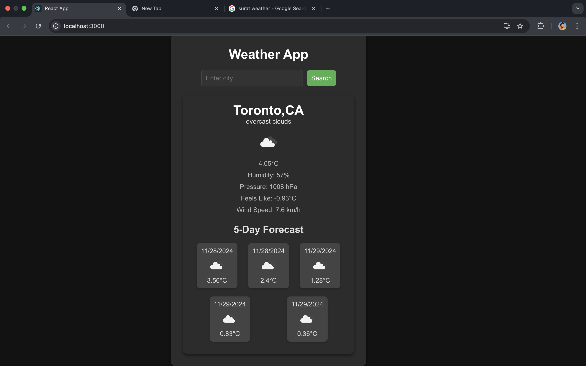
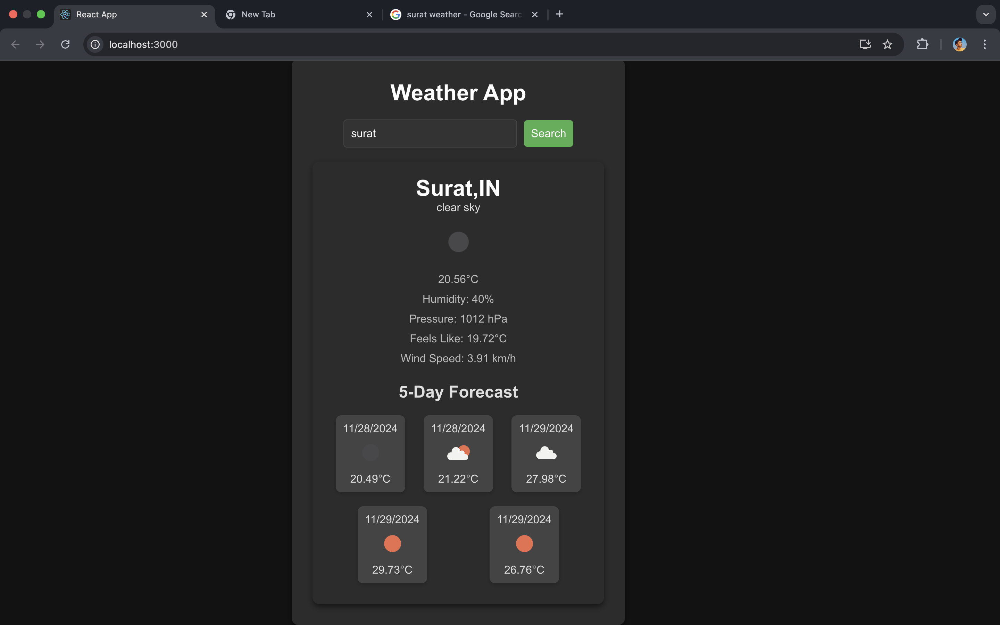
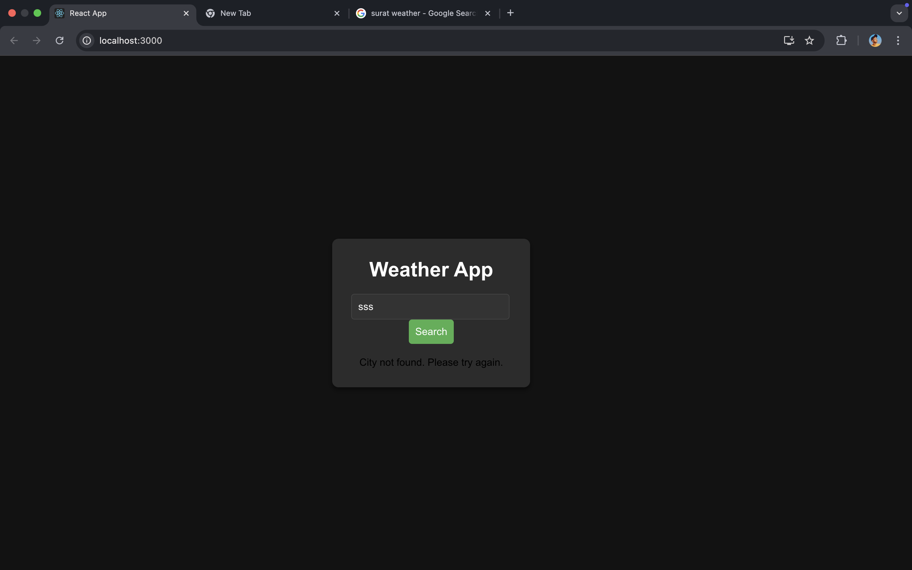

A simple weather application built using React and Axios to fetch weather data from the OpenWeatherMap API. The app provides current weather information and a 5-day forecast for any given city.

Displays the current temperature, humidity, pressure, and description of the weather.
Displays a 5-day weather forecast with temperature and weather icons.
Users can search for weather data by entering the name of a city.

Here are some screenshots showcasing the outputs:- 

 
By Default App will show Toronto’s weather and forecast

search by city name and app will show city’s weather and forecast for next 5 days

